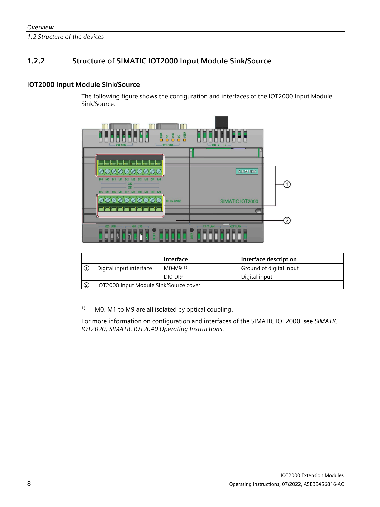
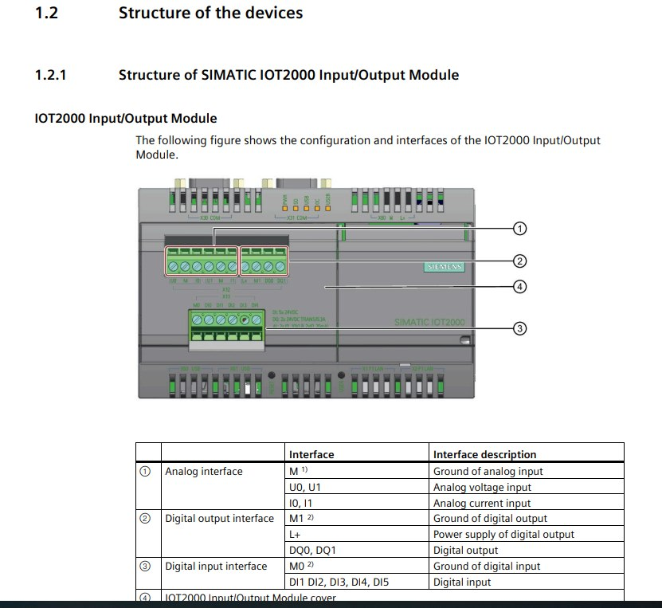
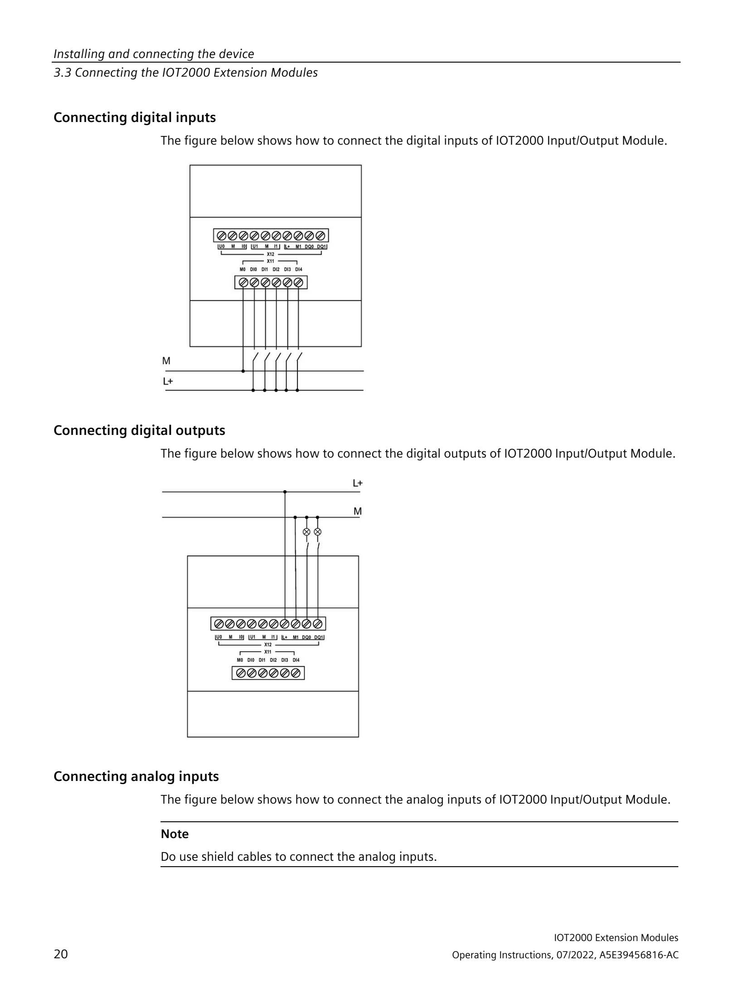
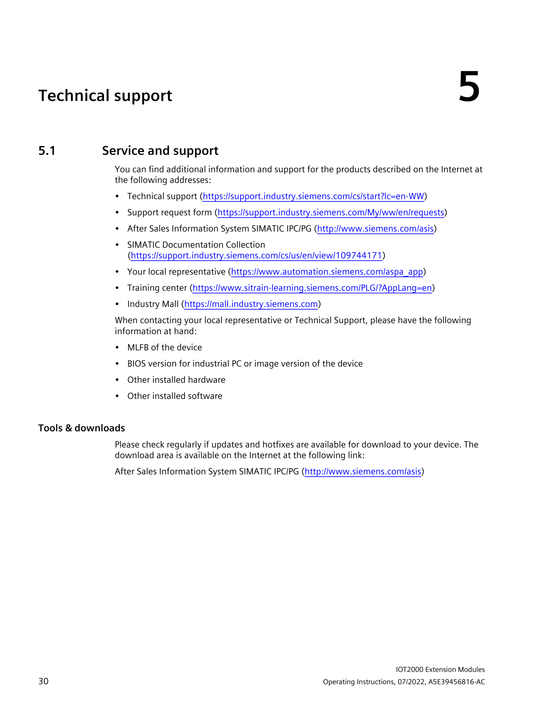

# IoT2050 IO Shield — Pràctica per a alumnes

## 📖 Manual oficial Siemens

Descarrega el manual complet aquí:
- **Siemens Support:** https://support.industry.siemens.com/cs/document/109745681/iot2000-extension-modules-operating-instructions
- **Document:** `A5E39456816-AB_Operating_Instructions_IOT2000_Extension_Modules_1910.pdf`

---

## 📦 Models del shield

| Model | Descripció |
|-------|-----------|
| **6ES7647-0KA01-0AA2** ⬅️ El nostre | **Input/Output Module** — 5x DI, 2x AI, **2x DQ** (amb sortides) |
| 6ES7647-0KA02-0AA2 | Input Module Sink/Source — 8x DI (només entrades) |

> El **0KA01** és el model complet amb **sortides digitals (DQ)**. El **0KA02** només té entrades.

---

## 🔍 Estructura física del mòdul (Secció 1.2.1 del manual)


*Vista general del mòdul: connectors, LEDs i bornes*


### Foto del mòdul real

*Mòdul 6ES7647-0KA01-0AA2 connectat al IoT2050*

### Llegenda del mòdul 6ES7647-0KA01-0AA2:

1. **Connector X1** — Bornes de cargol (13 pins) per a DI, DQ, AI i alimentació
2. **LEDs d'estat** — Indicadors de funcionament i comunicació
3. **Connector Arduino** — Pinheader per connectar al IoT2050
4. **Jumpers de configuració** — Per AI (0-10V / 0-20mA)

---


## 🎯 Objectiu

Controlar les sortides digitals **DQ0** i **DQ1** del shield IO Siemens 6ES7647-0KA01-0AA2 connectat al **SIMATIC IoT2050** mitjançant:

1. **PuTTY** (SSH) — Configurar els GPIOs manualment
2. **Node-RED** — Crear un dashboard web amb botons ON/OFF

---

## 📦 Material necessari

- IoT2050 amb shield IO connectat
- Font d'alimentació 24V DC
- Cables de connexió
- (Opcional) LEDs amb resistència o relé per veure les sortides
- Ordinador amb **PuTTY** instal·lat i connexió a la xarxa del IoT2050

---

## 🔌 1. Accés al IoT2050 via PuTTY

### 1.1 Connecta't per SSH

1. Obre **PuTTY**
2. Configura:
   - **Host Name (or IP address):** `192.168.200.1`
   - **Port:** `22`
   - **Connection type:** `SSH`
3. Fes clic a **Open**
4. Quan demani usuari, escriu: `root`
5. Quan demani contrasenya, escriu: `123456`

> ✅ Ja ets dins del IoT2050!

### 1.2 Comandes bàsiques per conèixer el sistema

```bash
# Veure informació del sistema
uname -a
cat /proc/device-tree/model

# Veure tots els GPIOs disponibles
gpiodetect

# Veure l'estat de tots els GPIOs
gpioinfo

# Veure informació detallada
cat /sys/kernel/debug/gpio
```

---

## ⚙️ 2. Configurar els GPIOs de les sortides DQ

Les sortides DQ0 i DQ1 es controlen a través del sistema de fitxers **sysfs** de Linux.

### 2.1 Exportar els GPIOs (si no ho estan ja)

```bash
# Exportar DQ0 (GPIO 355)
echo 355 > /sys/class/gpio/export

# Exportar DQ1 (GPIO 360)
echo 360 > /sys/class/gpio/export
```

> Si veieu l'error "Device or resource busy", vol dir que ja estan exportats. No passa res.

### 2.2 Configurar la direcció com a OUTPUT

```bash
# DQ0 com a sortida
echo out > /sys/class/gpio/gpio355/direction

# DQ1 com a sortida
echo out > /sys/class/gpio/gpio360/direction
```

### 2.3 Activar / Desactivar les sortides

```bash
# Activar DQ0 (posar a 1)
echo 1 > /sys/class/gpio/gpio355/value

# Desactivar DQ0 (posar a 0)
echo 0 > /sys/class/gpio/gpio355/value

# Activar DQ1
echo 1 > /sys/class/gpio/gpio360/value

# Desactivar DQ1
echo 0 > /sys/class/gpio/gpio360/value
```

### 2.4 Comprovar l'estat

```bash
# Llegir l'estat actual
cat /sys/class/gpio/gpio355/value
cat /sys/class/gpio/gpio360/value
```

> 📝 Retorna **0** = OFF, **1** = ON

### 2.5 Script complet per a l'arrencada

Per no haver de fer-ho cada vegada que es reinicia el IoT2050:

```bash
nano /etc/rc.local
```

Afegiu aquest contingut abans del `exit 0`:

```bash
# Exportar GPIOs del shield IO
echo 355 > /sys/class/gpio/export 2>/dev/null
echo 360 > /sys/class/gpio/export 2>/dev/null

# Configurar com a sortides
echo out > /sys/class/gpio/gpio355/direction
echo out > /sys/class/gpio/gpio360/direction

# Posar a OFF per defecte
echo 0 > /sys/class/gpio/gpio355/value
echo 0 > /sys/class/gpio/gpio360/value
```

Després:
```bash
chmod +x /etc/rc.local
```

---

## 🔌 3. Cablejat de les sortides DQ

**⚠️ IMPORTANT:** Les sortides DQ necessiten **alimentació externa de 24V DC** per funcionar.

### Esquema de connexió (del manual oficial Siemens)

#### Connexió de l'alimentació per a les sortides DQ


#### Connexió de les entrades digitals (DI)


#### Connexió de les sortides digitals (DQ) i entrades analògiques (AI)


### Hardware Interface — Taula d'assignació de pins


### Esquema resum

```
Bornes del shield IO (X1):

  [8] DQ0  ──────┐
                 ├──── Càrrega (LED+resistència, relé, etc.)
  [10] +24V DQ ──┘         │
                           └────── +24V (font externa)
  [11] 0V DQ ────────────── GND (font externa)

  [9] DQ1  ──────┐
                 ├──── Altra càrrega
  [10] +24V DQ ──┘
```

### Exemple amb LED

Per provar amb un LED indicador:

```
Borne 8 (DQ0) ──── LED ──── Resistència 1kΩ ──── Borne 10 (+24V DQ)
Borne 11 (0V DQ) ──────────────────────────────────── GND font 24V
```

Quan activeu DQ0 (`echo 1 > ...`), el LED s'encendrà.

## 🎛️ 4. Node-RED: Dashboard amb botons ON/OFF

Node-RED ja està instal·lat al IoT2050. L'editor web està a:

> **http://192.168.200.1:1880/**

### 4.1 Instal·lar el node-red-dashboard (si no està)

Connecteu-vos per SSH i executeu:

```bash
cd /usr/lib/node_modules/node-red
npm install node-red-dashboard
systemctl restart node-red
```

### 4.2 Importar el flow

1. Obre **http://192.168.200.1:1880/** al navegador
2. Ves al menú ☰ (tres ratlles) a dalt a la dreta
3. Selecciona **Import** → **Clipboard**
4. Obre el fitxer `flow.json` d'aquest repositori o enganxa el codi següent:
5. Fes clic a **Import**
6. Fes clic al botó **Deploy** (taronja, a dalt a la dreta)

### 4.3 Flow: 4 botons per controlar DQ0 i DQ1

```
                    ┌──────────────┐
                    │  Llegir (3s) │ (refresca l'estat cada 3 segons)
                    └──────┬───────┘
                           │
            ┌──────────────┼──────────────┐
            │              │              │
     ┌──────▼──────┐  ┌───▼────────┐
     │ Llegir DQ0  │  │ Llegir DQ1 │
     └──────┬──────┘  └────┬───────┘
            │              │
     ┌──────▼──────┐  ┌───▼────────┐
     │ Estat DQ0   │  │ Estat DQ1  │  (indicadors text)
     └─────────────┘  └────────────┘

┌──────────┐   ┌──────────┐   ┌──────────┐   ┌──────────┐
│ DQ0 ⬤ ON│   │ DQ0 ◯ OFF│   │ DQ1 ⬤ ON│   │ DQ1 ◯ OFF│
└────┬─────┘   └────┬─────┘   └────┬─────┘   └────┬─────┘
     │              │              │              │
     └──────┬───────┘              └──────┬───────┘
            │                            │
     ┌──────▼──────┐              ┌──────▼──────┐
     │ Exec DQ0    │              │ Exec DQ1    │
     │ (gpio355)   │              │ (gpio360)   │
     └─────────────┘              └─────────────┘
```

### 4.4 Accedir al Dashboard

Obre al navegador:

> **http://192.168.200.1:1880/ui/**

Hauries de veure una pantalla amb 4 botons:

```
┌──────────────────────────────────────────┐
│  🎛️ CONTROL IoT2050                      │
├──────────────────────────────────────────┤
│  SORTIDES DIGITALS                       │
│                                          │
│  ┌──────────────┐  ┌──────────────┐      │
│  │  DQ0 ⬤ ON   │  │  DQ0 ◯ OFF  │      │
│  └──────────────┘  └──────────────┘      │
│  Estat DQ0: 1                            │
│                                          │
│  ┌──────────────┐  ┌──────────────┐      │
│  │  DQ1 ⬤ ON   │  │  DQ1 ◯ OFF  │      │
│  └──────────────┘  └──────────────┘      │
│  Estat DQ1: 0                            │
└──────────────────────────────────────────┘
```

### 4.5 Com funciona cada botó

| Botó | Acció | Comando que s'executa |
|------|-------|----------------------|
| DQ0 ⬤ ON | Activa DQ0 | `echo 1 > /sys/class/gpio/gpio355/value` |
| DQ0 ◯ OFF | Desactiva DQ0 | `echo 0 > /sys/class/gpio/gpio355/value` |
| DQ1 ⬤ ON | Activa DQ1 | `echo 1 > /sys/class/gpio/gpio360/value` |
| DQ1 ◯ OFF | Desactiva DQ1 | `echo 0 > /sys/class/gpio/gpio360/value` |

---

## 📊 Resum del mapping

| Borne | Senyal | GPIO | Fitxer sysfs |
|-------|--------|------|-------------|
| 8 | **DQ0** | **gpio355** | `/sys/class/gpio/gpio355/value` |
| 9 | **DQ1** | **gpio360** | `/sys/class/gpio/gpio360/value` |
| 10 | +24V DQ | — | Alimentació externa |
| 11 | 0V DQ | — | Massa externa |

---

## 🧪 Prova ràpida

Des de PuTTY:

```bash
# Configurar
echo 355 > /sys/class/gpio/export
echo 360 > /sys/class/gpio/export
echo out > /sys/class/gpio/gpio355/direction
echo out > /sys/class/gpio/gpio360/direction

# Provar DQ0
echo 1 > /sys/class/gpio/gpio355/value   # 🔵 Encendre
echo 0 > /sys/class/gpio/gpio355/value   # ⚫ Apagar

# Provar DQ1
echo 1 > /sys/class/gpio/gpio360/value   # 🔵 Encendre
echo 0 > /sys/class/gpio/gpio360/value   # ⚫ Apagar
```

> ⚠️ **Recordeu:** Si les sortides no commuten, comproveu que teniu **24V DC connectat als bornes 10 i 11**.

---

## 📁 Contingut del repositori

```
iot2050-io-shield/
├── README.md              ← Aquest fitxer (guia per alumnes)
├── docs/
│   ├── pinout.md          ← Pinout detallat
│   └── node-red-dashboard.md ← Configuració avançada
├── nodered-flow/
│   └── flow.json          ← Flow de Node-RED (4 botons)
├── scripts/
│   ├── export-gpios.sh    ← Script per exportar GPIOs
│   └── setup-gpios.sh     ← Script per a rc.local
└── images/                ← Diagrames del manual
```

## 📄 Llicència

MIT — Ús educatiu lliure

## 📖 Manual oficial

El manual complet de Siemens es pot descarregar aquí:
- **Siemens Support:** https://support.industry.siemens.com/cs/document/109745681/iot2000-extension-modules-operating-instructions
- O直接 des del fitxer inclòs en aquest repositori.
