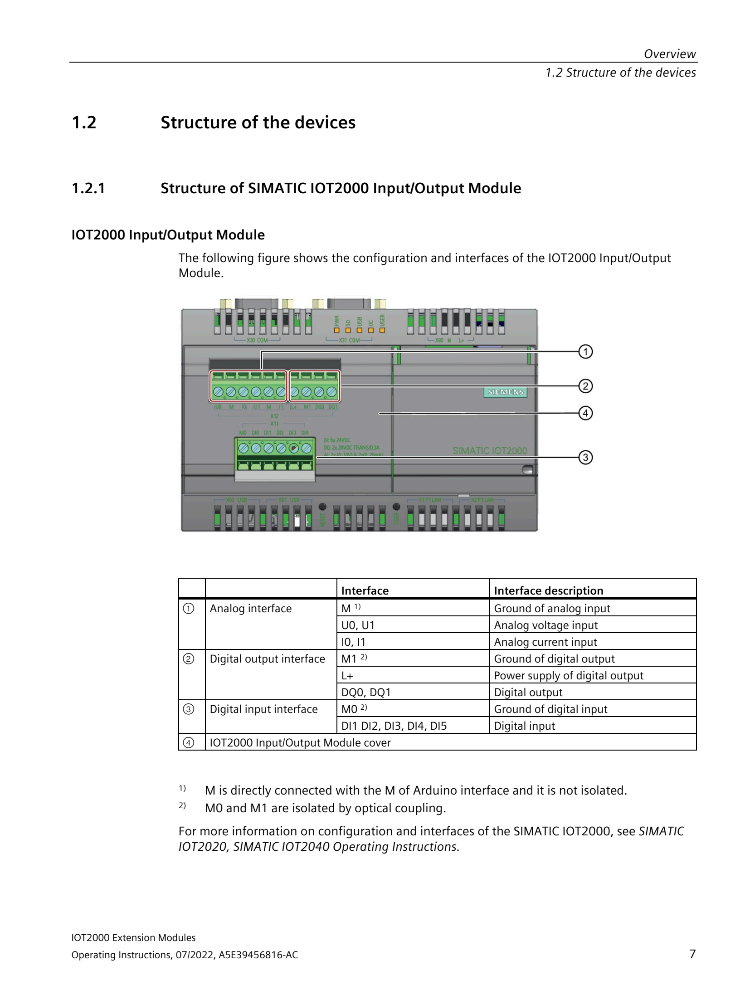

# IoT2050 IO Shield — Pràctica per a alumnes

## 📖 Manual oficial Siemens

Descarrega el manual complet aquí:
- **Siemens Support:** https://support.industry.siemens.com/cs/document/109745681/iot2000-extension-modules-operating-instructions
- **Document:** `A5E39456816-AB_Operating_Instructions_IOT2000_Extension_Modules_1910.pdf`

---

## 📦 Models del shield

| Model | Descripció |
|-------|-----------|
| **6ES7647-0KA01-0AA2** ⬅️ El nostre | **Input/Output Module** — 5x DI, 2x AI, **2x DQ** (amb sortides) |
| 6ES7647-0KA02-0AA2 | Input Module Sink/Source — 8x DI (només entrades) |

> El **0KA01** és el model complet amb **sortides digitals (DQ)**. El **0KA02** només té entrades.

---

## 🔍 Estructura física del mòdul

**Secció 1.2.1 del manual (Pàg. 7):**



*Pàg 7 del manual: estructura del mòdul amb descripció de cada connector*

### Llegenda del mòdul 6ES7647-0KA01-0AA2:

| Núm. | Connector | Descripció |
|------|-----------|------------|
| ① | **Analog interface M** | Massa de les entrades analògiques |
| | **U0, U1** | Entrades de tensió analògica (0-10V) → **Bornes 6, 7** |
| | **I0, I1** | Entrades de corrent analògica (0-20mA) |
| ② | **Digital output interface M** | Massa de les sortides digitals |
| | **DO0, DO1** | Sortides digitals (24V, 0.3A) → **Bornes 8 (DQ0), 9 (DQ1)** |
| ③ | **Digital input interface** | Entrades digitals → **Bornes 1-5 (DI0-DI4)** |
| | **M** | Massa de les entrades digitals |
| ④ | **X1** | Connector de bornes principal (13 pins) |
| ⑤ | **X2** | Alimentació externa per a les sortides DQ |
| ⑥ | **X3** | Connector Arduino (acoblament al IoT2050) |

---

## 🗺️ Pinout — Connexions als bornes (X1)

**Secció 4.2.3 del manual — Hardware Interface (Pàg. 30):**


*Pàg 30: taula d'assignació de pins del connector X1*

### Taula resum:

| Borne | Senyal | GPIO | Sysfs |
|-------|--------|------|-------|
| 1 | DI0 | gpio437 | `/sys/class/gpio/gpio437/value` |
| 2 | DI1 | gpio438 | `/sys/class/gpio/gpio438/value` |
| 3 | DI2 | gpio439 | `/sys/class/gpio/gpio439/value` |
| 4 | DI3 | gpio441 | `/sys/class/gpio/gpio441/value` |
| 5 | DI4 | gpio345 | `/sys/class/gpio/gpio345/value` |
| 6 | AI0 | — | A0 (ADC) |
| 7 | AI1 | — | A1 (ADC) |
| **8** | **DQ0** | **gpio355** | **`/sys/class/gpio/gpio355/value`** |
| **9** | **DQ1** | **gpio360** | **`/sys/class/gpio/gpio360/value`** |
| 10 | +24V DQ | — | Alimentació externa DQ (+) |
| 11 | 0V DQ | — | Massa DQ |
| 12 | +24V | — | Alimentació del mòdul |
| 13 | 0V/GND | — | Massa general |

---

## 🔧 Com es va descobrir el número de GPIO?

> 💡 **Tipus de sortida:** Segons el datasheet (Pàg. 26), les DQ són **"current-sourcing" (PNP)**. Això vol dir que **proporcionen +24V** quan s'activen, no que connectin a GND. Per tant, la càrrega va **entre DQ i GND (borne 11)**, no entre DQ i +24V.

Al contrari d'altres sistemes on els GPIOs tenen números fixos (com el GPIO2 d'un ESP32), al IoT2050 els números depenen de com el kernel assigna els controladors en arrencar.

### Pas 1: Identificar els gpiochips

```bash
gpiodetect
```

Al IoT2050 hi ha **6 gpiochips**. Ens interessen els que tenen senyals **IO0-IO13** i **A0-A5**:

| Chip | GPIOs | Dispositiu | Funció |
|------|-------|-----------|--------|
| gpiochip0 | 496-511 | PCAL9535 (I2C 1-0020) | Pull-ups + enables |
| gpiochip1 | 480-495 | PCAL9535 (I2C 1-0021) | Direcció IO0-IO13 |
| gpiochip2 | 464-479 | PCAL9535 (I2C 1-0025) | Pull-ups selectius |
| **gpiochip3** | **408-463** | **42110000.gpio** | **GPIOs del processador (IO0-IO13, A0-A5)** |
| **gpiochip4** | **312-407** | **600000.gpio** | **GPIOs del processador (IO4-IO9)** |
| gpiochip5 | 222-311 | 601000.gpio | Altres perifèrics |

### Pas 2: Llistar les línies

```bash
gpioinfo gpiochip3
gpioinfo gpiochip4
```

A **gpiochip3** (base 408, 56 línies):
```
line 29: "IO0" → gpio408+29 = gpio437  → DI0 (Borne 1)
line 30: "IO1" → gpio408+30 = gpio438  → DI1 (Borne 2)
line 31: "IO2" → gpio408+31 = gpio439  → DI2 (Borne 3)
line 33: "IO3" → gpio408+33 = gpio441  → DI3 (Borne 4)
```

A **gpiochip4** (base 312, 96 línies):
```
line 33: "IO4" → gpio312+33 = gpio345  → DI4 (Borne 5)
line 43: "IO7" → gpio312+43 = gpio355  → DQ0 (Borne 8) ✅
line 48: "IO8" → gpio312+48 = gpio360  → DQ1 (Borne 9) ✅
```

### Pas 3: Comprovar-ho experimentalment

```bash
echo 1 > /sys/class/gpio/gpio355/value   # Activar → tester marca 24V
cat /sys/class/gpio/gpio355/value        # Retorna 1 ✅
echo 0 > /sys/class/gpio/gpio355/value   # Desactivar → tester marca 0V
```

> 🧪 **Fórmula:** `Número GPIO = base_del_chip + número_de_línia`

---

## 🔌 Cablejat de les sortides DQ

**⚠️ IMPORTANT:** Les sortides DQ necessiten **alimentació externa de 24V DC** (bornes 10 i 11).

> 🔧 **Tipus de sortida: Current-sourcing (PNP).** Segons el datasheet (Pàg. 26 del manual), les DQ commuten a **+24V** (no a GND). Per tant, la càrrega es connecta **entre DQ i 0V DQ (borne 11)**.

### Alimentació per a les sortides DQ (Pàg. 20 del manual)


*Pàg 20: connexió de la font d'alimentació externa per a DQ0 i DQ1*

> Cal connectar una font de 9-36V DC als bornes **10 (+24V DQ)** i **11 (0V DQ)**

### Connexió de les entrades digitals (Pàg. 21 del manual)


*Pàg 21: connexió dels sensors/ interruptors a les entrades DI0-DI4*

### Connexió de les sortides digitals i entrades analògiques (Pàg. 22)


*Pàg 22: connexió de càrregues a DQ0/DQ1 i sensors analògics a AI0/AI1*

### Esquema resum

```
               ┌──────────────────────────────┐
               │        IoT2050 + Shield        │
               │                               │
  [Borne 12]───┤ +24V   (alimentació mòdul)    │
  [Borne 13]───┤ GND    (massa mòdul)          │
               │                               │
  [Borne 10]───┤ +24V DQ ──── Font 24V DC (+)  │
  [Borne 11]───┤ 0V DQ  ──── Font 24V DC (-)  │
               │                               │
  [Borne  8]───┤ DQ0 ──── Càrrega ────┐       │
               │                      │        │
  [Borne 11]───┤ 0V DQ ───────────────┘       │
               │                               │
  [Borne  1]───┤ DI0 ──── Sensor/Polsador      │
               └──────────────────────────────┘
```

### Exemple amb LED

```
Borne 8 (DQ0) ──── LED ──── Resistència 1kΩ ──── Borne 11 (0V DQ)
Borne 10 (+24V DQ) ────────────────────────────────── Font 24V (+)
```

Quan activeu DQ0 (`echo 1 > ...`), el LED s'encendrà.

---

## 🔌 1. Accés al IoT2050 via PuTTY

1. Obre **PuTTY**
2. **Host Name:** `192.168.200.1`
3. **Port:** `22` · **Connection type:** `SSH`
4. **Open** → usuari: `root` · contrasenya: `123456`

Comandes per conèixer el sistema:
```bash
uname -a                    # Informació del sistema
gpiodetect                  # Veure gpiochips
gpioinfo gpiochip4          # Veure GPIOs del chip 4
cat /sys/kernel/debug/gpio  # Estat complet
```

---

## ⚙️ 2. Configurar els GPIOs de les sortides DQ

```bash
# Exportar (si cal)
echo 355 > /sys/class/gpio/export
echo 360 > /sys/class/gpio/export

# Configurar com a sortida
echo out > /sys/class/gpio/gpio355/direction
echo out > /sys/class/gpio/gpio360/direction

# Activar / Desactivar
echo 1 > /sys/class/gpio/gpio355/value   # DQ0 ON
echo 0 > /sys/class/gpio/gpio355/value   # DQ0 OFF
echo 1 > /sys/class/gpio/gpio360/value   # DQ1 ON
echo 0 > /sys/class/gpio/gpio360/value   # DQ1 OFF

# Llegir estat
cat /sys/class/gpio/gpio355/value
```

### Prova amb el multímetre

Connecteu el tester en mode **V⎓ DC** entre:
- **Borne 8 (DQ0)** i **Borne 11 (0V DQ)**
  - DQ0 = ON → marca **~24V** ✅ (la sortida DONA +24V)
  - DQ0 = OFF → marca **~0V** ❌

> Segons el datasheet (Pàg. 26), les sortides DQ són **"current-sourcing" (PNP)**: proporcionen **+24V** al borne 8 quan s'activen.

---

## 🎛️ 3. Node-RED: Dashboard amb botons ON/OFF

### 3.1 Instal·lar node-red-dashboard (si no està)

```bash
cd /usr/lib/node_modules/node-red
npm install node-red-dashboard
systemctl restart node-red
```

### 3.2 Importar el flow

1. Obre **http://192.168.200.1:1880/** (editor)
2. ☰ Menu → **Import** → **Clipboard**
3. Enganxa el contingut de `nodered-flow/flow.json`
4. **Deploy** (botó taronja)

### 3.3 El flow: 4 botons + 2 indicadors

```
┌──────────────────────────────────────────┐
│  🎛️ CONTROL IoT2050                      │
├──────────────────────────────────────────┤
│  SORTIDES DIGITALS                       │
│                                          │
│  ┌──────────────┐  ┌──────────────┐      │
│  │  DQ0 ⬤ ON   │  │  DQ0 ◯ OFF  │      │
│  └──────┬───────┘  └──────┬───────┘      │
│         │                 │              │
│         └────────┬────────┘              │
│                  │                       │
│          ┌───────▼───────┐               │
│          │ exec "echo X   │               │
│          │ > gpio355/value│               │
│          └───────┬───────┘               │
│                  │                       │
│          ┌───────▼───────┐               │
│          │ Estat DQ0: 1  │               │
│          └───────────────┘               │
│                                          │
│  ┌──────────────┐  ┌──────────────┐      │
│  │  DQ1 ⬤ ON   │  │  DQ1 ◯ OFF  │      │
│  └──────┬───────┘  └──────┬───────┘      │
│         │                 │              │
│         └────────┬────────┘              │
│                  │                       │
│          ┌───────▼───────┐               │
│          │ exec "echo X   │               │
│          │ > gpio360/value│               │
│          └───────┬───────┘               │
│                  │                       │
│          ┌───────▼───────┐               │
│          │ Estat DQ1: 0  │               │
│          └───────────────┘               │
└──────────────────────────────────────────┘
```

Cada botó executa: `echo {valor} > /sys/class/gpio/gpio{355/360}/value`

### 3.4 Dashboard

Obre **http://192.168.200.1:1880/ui/** i prova els botons!

---

## 🧪 Prova ràpida des de PuTTY

```bash
# Exportar i configurar
echo 355 > /sys/class/gpio/export
echo 360 > /sys/class/gpio/export
echo out > /sys/class/gpio/gpio355/direction
echo out > /sys/class/gpio/gpio360/direction

# Provar DQ0
echo 1 > /sys/class/gpio/gpio355/value   # 🔵 ON
echo 0 > /sys/class/gpio/gpio355/value   # ⚫ OFF

# Provar DQ1
echo 1 > /sys/class/gpio/gpio360/value   # 🔵 ON
echo 0 > /sys/class/gpio/gpio360/value   # ⚫ OFF
```

> ⚠️ **Recordeu:** Si no commuta, comproveu que teniu **24V DC als bornes 10 i 11**.
> Si encara no funciona, proveu `cat /sys/class/gpio/gpio355/direction` per confirmar que sigui **"out"**.

---

## 📁 Contingut del repositori

```
iot2050-io-shield/
├── README.md                    ← Aquesta guia
├── docs/
│   └── node-red-dashboard.md    ← Configuració avançada
├── nodered-flow/
│   └── flow.json                ← Flow de Node-RED (4 botons)
├── scripts/
│   ├── export-gpios.sh          ← Exporta i configura GPIOs
│   └── setup-gpios.sh           ← Per a rc.local (arrencada)
└── images/
    ├── structure-page7.png      ← Pàg 7: estructura del mòdul
    ├── hardware-interface-pinout.png ← Pàg 30: pinout X1
    ├── wiring-power-dq.png      ← Pàg 20: alimentació DQ
    ├── wiring-digital-inputs.png← Pàg 21: connexions DI
    └── wiring-digital-outputs-analog.png ← Pàg 22: connexions DQ+AI
```

## 📄 Llicència

MIT — Ús educatiu lliure
